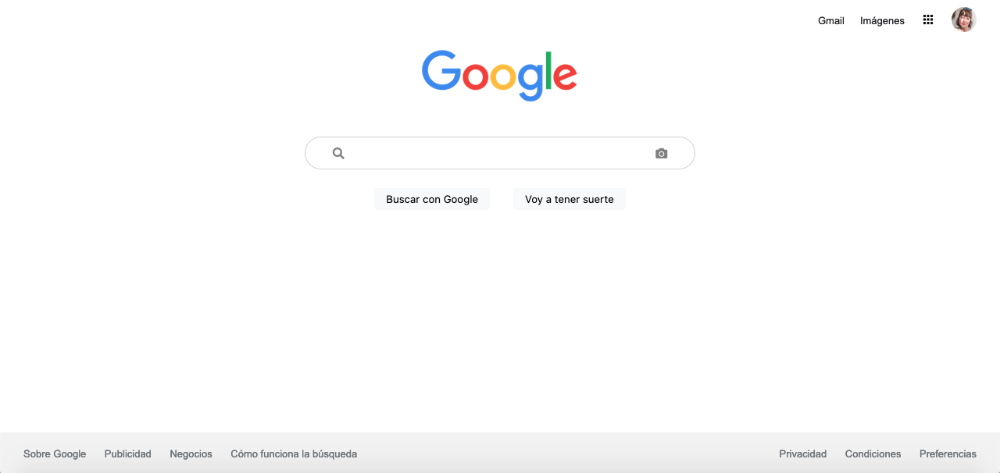

# Clon de Google Search

## Descripción del Proyecto 

El objetivo de este proyecto era recrear la interfaz gráfica de la página de búsqueda de Google usando HTML y CSS para mejorar nuestras habilidades de diseño web en relación con la estructura y los estilos.

Esta práctica forma parte de las actividades realizadas durante el bootcamp de Tecnolochicas PRO Summer, enfocado en desarrollo web front-end.

[Aquí](https://cheerful-lolly-07ccb4.netlify.app/) puedes ver la página desplegada.

